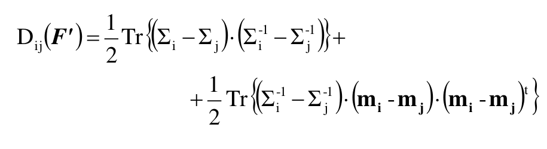
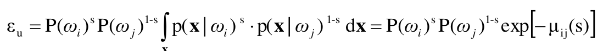
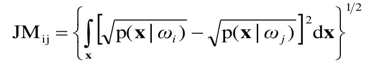
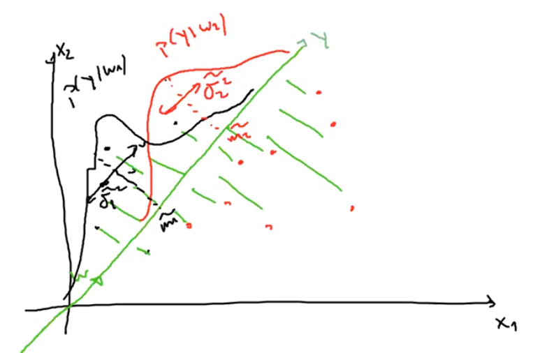

# Feature Reduction

Generally, it happens that the number of features are in the order of tens or hundreds, and it may seem that each feature is important. Also, if the model performance seems inadequate, it is natural to consider adding new features, even if the model will be more complex, in order to improve the performance.

Sometimes, however, adding too many features can lead to worse performance (curse of dimensionality, Hughes effect), because the discriminative power of the features is not enough to compensate for the complexity of the model. In this case, it is necessary to reduce the number of features.

This may happen because some wrong assumptions were made in model selection, or because the data is not enough to support the model complexity (feature dimensionality is too high for the number of samples). To avoid this, you can reduce the number of features or simplify the model.

When you perform feature reduction, you are trying to minimize the implementation cost of the model as well as the computational load, and to overcome the Hughes effect.

## Hughes effect

When the number of training samples and features is **unbalanced**, the pdf estimation becomes more difficult, leading to **unreliable** result. This effect is caused by the **exponential increase in volume** when adding features to a given space.

If you try to calculate the rate between the volume of a (hyper)sphere and the volume of a (hyper)cube, as the number of dimensions increases, the ratio between the two volumes tends to zero: this means that the most of the volume is concentrated in the corners of the cube. When speking about the number of features, this means that the most of the densities are concentrated in the corners of the feature space, not in the center of the space, where it should be.

This is the reason why we need to increase the number of samples when the number of features increases; if we don't do that, the distance between a sample and the origin will increase, increasing also the emptiness of the space, without being able to fill it with more samples.

If the ratio between the number of samples and the number of features is lower than what we were expecting, the model will tend to overfit the data.

# Feature Reduction Approaches

So, you trying to minimize the number of features, while keeping the discrimination capability of the model as high as possible. To do that, there are two main approaches:

- **Feature Selection**: you select a subset of the original features, trying to keep the most relevant ones.

- **Feature Extraction**: you create a new set of features, using a combination of the original features, trying to keep the most relevant ones.

## Feature Selection

There are different approaches to feature selection:

- **Filter methods**: you start with all the features and you remove the less relevant ones.

- **Wrapper methods**: you start with no features and you add the most relevant ones.

- **Embedded methods**: you start with all the features and you remove the less relevant ones, but you do that during the training phase.

But, in order to select the most relevant features, you need to define a metric to measure the separability measure and a search strategy to find the best subset of features.

### Divergence Measure

Considering a couple of classes, with each class having a model and a prior probability, we want to measure the separability between the two classes: the less the overlap between the two classes, the better the separability, and we want a way to measure this overlap.

For example you can perform a difference (the smaller the difference, the bigger the overlap) or a ratio (if it is close to 1, the overlap is big) between the two models, but this measures are not good because they are not symmetric: if you swap the two classes, the measure will change; also I need an average measure of the difference between the two classes, not a istantaneous measure between points of the two classes.

The divergence measure can be written as:

$D_{ij}(F')=\mathbb{E}[\ln\frac{p(x|\omega_i)}{p(x|\omega_j)}|\omega_i]+\mathbb{E}[\ln\frac{p(x|\omega_j)}{p(x|\omega_i)}|\omega_j]=\int{\ln\frac{p(x|\omega_i)}{p(x|\omega_j)}p(x|\omega_i)dx}+\int{\ln\frac{p(x|\omega_j)}{p(x|\omega_i)}p(x|\omega_j)dx}=\int{\ln\frac{p(x|\omega_i)}{p(x|\omega_j)}[p(x|\omega_i)-p(x|\omega_j)]dx}$

where $F'$ is the subset of features, $p(x|\omega_i)$ is the probability of a sample $x$ belonging to class $\omega_i$ and $E\{\cdot\}$ is the expectation operator.

In the case of a Gaussian model, the divergence measure can be written as:

where $Tr$ is the trace operator (sum of the diagonal elements of a matrix).

Speaking about the properties of the divergence measure:

- If the two classes are completely overlapped, the divergence measure will be zero, and if the two classes are completely separated, the divergence measure will be greater than zero.
- The divergence measure is symmetric, so if you swap the two classes, the measure will not change.
- The divergence measure has also a monotonic property: if you add a feature to the subset, the divergence measure will increase or remain the same, but it will never decrease.
- If the features are independent, the divergence measure will be the sum of the divergence measures of the single features.
- The larger the divergence measure, the better the separability.

The only problem is an interpretability one, the fact that the divergence measure will continue to increase even if the accuracy of the model is not improving anymore (when the accuracy tends to 100%), and thus has not this saturation behavior.

When multiple classes are involved, the divergence measure can be written as a matrix of divergence measures, filled with 0 in the diagonal and with the divergence measure between the two classes in the other cells, simmetric with respect to the diagonal. To get only a single value, it is possible to sum the elements involved (with a weight for each class) or returning the lowest binary divergence measure, adopting the **worst-case** approach.

### Bhattacharyya Distance

The Bhattacharyya distance makes use of the probability of error of the Bayes classifier, defined as:

$P(error)=P(error|\omega_1)*p(\omega_1)+P(error|\omega_2)*p(\omega_2)=P(x\rarr\omega_2|\omega_1)*p(\omega_1)+P(x\rarr\omega_1|\omega_2)*p(\omega_2)=\int_{-\infin}^\infin{\min\{p(x|\omega_1)*p(\omega_1), p(x|\omega_2)*p(\omega_2)\}dx}$

The integral of a minumum is quite difficult to calculate, so we use an upper bound called **Chernoff bound** (**Bhattacharyya bound** when $s=\frac{1}{2}$)

with $\mu_{ij}(s)$ the **Chernoff distance**

The smallest the value of $\epsilon_u$, the better the separability between the two classes.

$s$ is not know, so has to be estimated, by finding the one that maximizes $\mu_{ij}(s)$ or by fixing it.

<!-- formulas? -->

So generally speaking, when you have to decide between two classes, you check the probability of error of each Bayes classifier, and you choose the one with the lowest probability of error.

So, speaking about the properties of the Bhattacharyya distance:

- If the two classes are completely overlapped, the Bhattacharyya distance will be zero, and if the two classes are completely separated, the Bhattacharyya distance will be greater than zero.
- The Bhattacharyya distance is symmetric, so if you swap the two classes, the measure will not change.
- The Bhattacharyya distance has also a monotonic property: if you add a feature to the subset, the Bhattacharyya distance will increase or remain the same, but it will never decrease.
- If the features are independent, the Bhattacharyya distance will be the sum of the Bhattacharyya distances of the single features.
- No saturing behaviour
- Multiclass case: same as the divergence measure

### Jeffries-Matusita Distance

The Jeffries-Matusita distance is an average distance between two density functions, and it can be written as:

but it can be expressed in terms of the Bhattacharyya distance as $JM_{ij}=\sqrt{2(1-1\exp(-B_{ij}))}$, derived from:

$JM^2_{ij}=\int{(\sqrt{p(x|\omega_i)}-\sqrt{p(x|\omega_j)})^2dx} = \int{(p(x|\omega_i)+p(x|\omega_j)-2\sqrt{p(x|\omega_i)p(x|\omega_j)})dx} = \int{p(x|\omega_i)} + \int{p(x|\omega_j)} - 2\int{\sqrt{p(x|\omega_i)p(x|\omega_j)}dx} = 1 + 1 - 2\exp(-B_{ij}) = 2(1 - \exp(-B_{ij}))$

In this case, when Bhattacharyya distance is 0, the Jeffries-Matusita distance is 0, and when Bhattacharyya distance tends to infinity, the Jeffries-Matusita distance tends to $\sqrt{2}$.

The difference from the other is the fact that has a saturation behaviour, so the distance will not increase if the accuracy of the model is not improving anymore.

## Search strategies

Once the separability criterion is chosen, the next step is to decide a **search strategy** to find the best subset of features that maximizes the separability criterion.

One of them could be exhaustive search, but can be very time and computationally expensive, so it is not a good choice (if you want to decrease the feature from $n$ to $m$, you have to examine $\binom{n}{m}$ case), even if it will give you the optimal solution.

Instead, the way to go is using **subotimal search strategies**.

### Sequential Forward Selection (SFS)

It is an iterative boosting algorithm, that starts from an empty subset of features and iteratively adds the feature that maximizes the separability criterion.

In the beggining, the first feature is chosen by taking the one the optimizes singularly the separability criterion, and then the others are added one by one, by comparing the separability criterion with the previous subset of features.

It is considered suboptimal because once a feature is added, it is not removed anymore, even if it could be better to remove it and add another one.

### Sequential Backward Selection (SBS)

It is the opposite of SFS, it starts from the full set of features and iteratively removes the feature with the lowest contribution to the separability criterion.

It is very fast even with a large number of features, but, same here, once a feature is removed, it is not added anymore.

## Feature Extraction

Another possibility is to use **feature extraction** to reduce the dimensionality of the dataset, by combining the features into new ones: for example, passing from 2 features to 1, more information are carried if you combine the two features into a single one, instead of choosing one of them.

The feature are combined together by using **linear** or **nonlinear transformations**, using the labels (**supervised training**) or not (**unsupervised**); based on the goal you want to achieve, there are different methods:

- minimizing classification error
- maximizing class separability (**LDA**: projections that best separates the data)
- retaining interesting transformations
- minimizing reconstruction error (**PCA**: projections that best represents the data)
- maximizing feature independence (**ICA**)

Linear combinations are usually preferred, because they reduce the computational complexity and they are easier to interpret.

### Principal Component Analysis (PCA)

It is an unsupervised method, that is used to reduce the dimensionality of the dataset, by projecting the data into a lower dimensional space.

A new feature is now mapped to $\hat x_i = \sum_{k=1}^m{y_{k_{i}}\phi_k}$ with $\phi_k$ transformations (orthogonal and with orthonormal basis).

The error that should be minimized is defined as:

$\sum_{i=1}^n || x_i - \hat x_i ||^2 = \sum_{i=1}^n||x_i - \sum_{k=1}^m{y_{k_{i}}\phi_k}||^2$ ($y_{ik}$ the projection of $x_i$ in the subspace generated by $\phi_k$ bases)

The error is minimized when these $\phi_k$ are the eigenvectors of the scatter matrix $S$, obtained by multiplying the covariance matrix $\Sigma$ (eigenvectors are the same) by $N (-1)$, calculated from the samples $x_i$.

Once the eigenvalues are extracted by calculating the determinant of the matrix $S$, you order them in descending order: the first eigenvalue represent the variance of the data while the first eigenvector is the direction of the maximum variance, and so on, with the variance decreasing until the last eigenvalue.

Defining $\Phi=[\phi_1, \phi_2, ..., \phi_m]$ (with shape $m*n$) and $X=[x_1, x_2, ..., x_n]$ (with shape $n*1$) the new features are $Y = \Phi^TX$ (with shape $m*1$).

If you don't know how much features you want to keep, you can use the energy criterion: you keep the first $m$ features that represent at least $90\%$ of the total variance ($\sum_{i=1}^m{\lambda_i}/\sum_{i=1}^n{\lambda_i} \geq 0.9$).

### Linear Discriminant Analysis (LDA)

In this case, instead of searching for the efficient representation of the data, we are looking for the efficient discrimination of the data, for the best separation between the classes, using the labels (**supervised** approach).

What you want to do is finding the best projection of the data (onto a line, a plane, a hyperplane) that maximizes the separation between the classes.

The goal is to find that vector $w$ defining the projection surface: it is done trying to maximize the distance between the classes, while minimizing the variance within the classes.

Our $w$ is the one that maximizes the **Fisher criterion**, defined as $F = \frac{||\tilde{m}_1-\tilde{m}_2||^2}{\tilde{s}_1 + \tilde{s}_2}$ where $\tilde{m}_i$ is the mean of the class $i$ and $\tilde{s}_i$ is the scatter Matrix of the class $i$ (the covariance matrix of the class $i$ multiplied by the number of samples of the class $i$); but $F$ is not defined in term of $w$.

To find $w$ first we have to define the scatter matrix $S_B = (m_1-m_2)(m_1-m_2)^T$ (between class scatter matrix) and $S_W = S_1 + S_2$ (within class scatter matrix): luckily, $w*S_B*w^T = (\tilde{m}_1-\tilde{m}_2)^2$ and $w*S_W*w^T = \tilde{s}_1 + \tilde{s}_2$, so we can rewrite $F$ as $F = \frac{w*S_B*w^T}{w*S_W*w^T}$ also called **Generalized Rayleigh Ratio**. Now we can find $w$ by maximizing $F$.

Simpling by computing $S_W^{-1}(m_1-m_2)$ we can obtain the optimal $w$.

In the case of multiclass LCA, we don't have just a vector $w$, but a matrix $W$ with shape $n*(c-1)$, where $c$ is the number of classes, with generalized scatter matrices $S_B$ (with global mean) and $S_W$.

To compute the $W$ that maximizes $F$ is just needed to compute the eigenvectors of $S_W^{-1}S_B$ associated to the largest eigenvalues.