# Statistical Estimation Theory

## Introduction

Statistical estimation is an important part in machine learning, since you want to estimate the statistical distribution of the data you have, using only the subset of observations you have (samples).

You want to use the samples you have to find the decision boundary that best separates the classes, or to find the most important features, or to find the probability of a given sample to belong to a certain class. In general you have to find a statical model that suits your data, so when you give it a new input, it gives you an output that is as close as possible to the ideal one (the one you would have if you had all the data). 

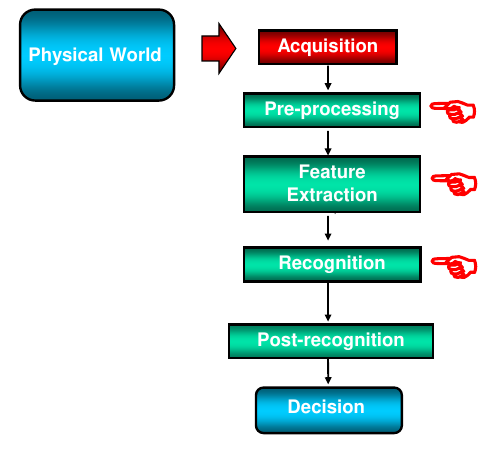

In particular, this estimation can be necessary during pre-processing, in order to normalize the data, or during feature extraction, in order to extract the most important features, or during recognition, in order to estimate the probability of a given sample to belong to a certain class.

In general only some samples of the overall data are available, and with them we want to find a model that can be used to estimate the distribution of the whole data, model that could be parametric or non-parametric; after querying the model, we receive some output.

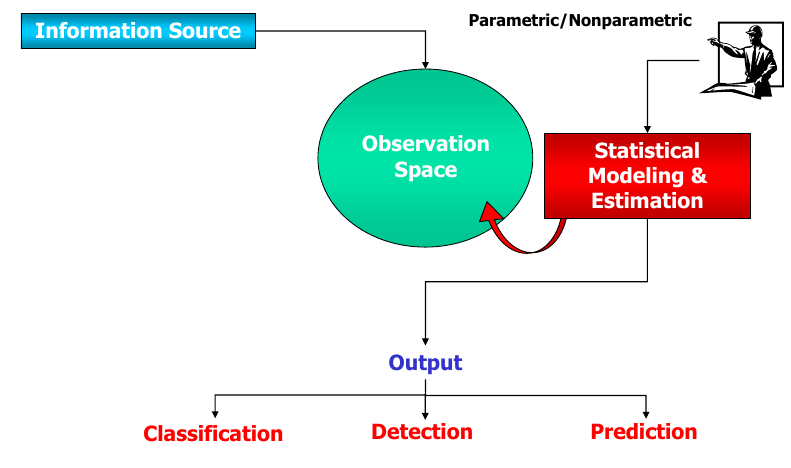

The information source from which the data is coming from, even if some noise are present, could be completely known (e.g. original source is known), partially known (e.g. you know is a sin signal, but you don't know the frequency and the amplitude) or completely unknown (e.g. you don't know anything, you have to base on your observations), but in the real world, the last two cases are the most common.

In pratical terms, what we want to estimate is the probability density function (pdf) of the data.

## PDF Estimation

I have n points in feature space, and I want to estimate the probability density function (pdf) of each feature, in order to find the most important features.

If we consider $x=(x_1, x_2, ..., x_n)$ as a vector of n features (a point in feature space) with unknown pdf $p(x)$ and $X=\{x_1, x_2, ..., x_n\}$ as a finite set of independent and identically distributed (iid) samples (the cloud, the collection of points) drawn from $p(x)$ called training samples, we want to determine an estimate $p̂(x)$ on the basis of the training samples $X$, that is close as possible to the true pdf $p(x)$.

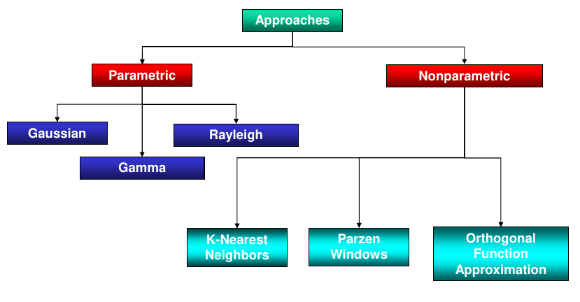

Based on the approach we want to use, we can distinguish between parametric and non-parametric approaches.

In the parametric ones, you know the shape of the data, but you don't know the parameters of the pdf, so you have to estimate them; in the non-parametric ones, you don't know anything about the shape of the data, so you have to estimate the pdf directly.

### Parametric Estimation

We have a model $p(x)$ characterized by a set of parameters $\theta=(\theta_1, \theta_2, ..., \theta_n)$, written as $p(x|\theta)$, in order to express the dependence of the pdf on the parameters.

Given the parameters $\theta$, the likelihood function is the probability of obtaining the training samples $X$ according to these parameters, so it is a measure of how well the parameters $\theta$ fit the training samples $X$.

Since the distribution of a feature is independent from the others, the likelihood function is the product of the likelihood of each feature, so we can write it as

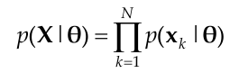

For example, if we have a Gaussian distribution, the likelihood function is $p(x|\theta)=p(x|\mu, \sigma^2)\sim\mathcal{N}(\mu, \sigma^2)$, where $\mu$ is the mean and $\sigma^2$ is the variance. If you fix the variance to 1, and vary the mean, you can see that the likelihood function assumes different values, and you want to find the one that maximizes the likelihood function, putting you closest to the mean of the data.

At the end, the likilihood function is a function of $\mu$, with some $\mu$ values giving higher likelihood values than others, so you want to find the $\mu$ that maximizes the likelihood function, distribuited still according to a Gaussian distribution, with mean $\mu_0$ and parameter $\mu$.

There are two main procedures to estimate the parameters $\theta$:

1. Maximum Likelihood Estimation (MLE): $\theta_i$ values are fixed but unknown, and the best estimate is the one that maximizes the probability of obtaining the training samples $X$.

2. Bayesian Estimation: $\theta_i$ are random variables with a known prior distribution; thanks to the observations $X$, we can update the prior distribution to obtain the posterior distribution of $\theta_i$.

### Estimation Goodness

You want to use somthing called estimator which can be considered as a black box that takes as input the training samples $X$ and outputs the estimated parameters $\hat\theta$.

When calculating the parameters using the training samples, we want our estimatation $\hat\theta$ to be as close as possible to the true parameters $\theta$, or in other words, we want to minimize the estimation error (the difference between the true parameters and the estimated ones, a value depending on the training samples and the parameters).

If different training samples are used, the estimation error will be different, so we want to find a way to measure the goodness of the estimator, in order to find the best estimator: ideally, we want each estimation error $\epsilon_i$ to be unbiased and without variance.

It is unbiased if $\mathbb{E}[\epsilon_i]=0$, so $\mathbb{E}[\hat\theta_i]=\theta_i$ (the expected value of the estimator is equal to the true value of the parameter).

The variance, describing how much the estimator varies from the true value, is the expected value of the squared error ($var(\epsilon_i)=\mathbb{E}[(\hat\theta_i-\theta_i)^2]$), and ideally we want it to be zero; in the reality, it is impossible to get at this point, so instead
you try to reach a lower bound, called Cramer-Rao lower bound (CRLB), which express a lower bound on the variance of the estimator $\hat\theta_i$ (which should be unbiased). It makes use of the Fisher information, which computes the pickness of the likelihood function (if the likelihood function is pick, the uncertainty on the parameters is low, and viceversa). When the CRLB is reached, the estimator is said to be efficient.

In the reality is quite impossibile to obtain unbiased estimators, so, instead, we can try to collect as many data as possible, in order to reduce the variance of the estimator: in other words, the estimator is good if it is (asympotically) unbiased, (asympotically) efficient and consistent (iif asymptotically unbiased and variance converges to zero) when the number of training samples tends to infinity.

# Maximum Likelihood Estimation

The maximum likelihood estimate of $\theta$ is $\hat\theta = \arg\max_{\theta} p(X|\theta)$, which is the value of $\theta$ that maximizes the likelihood function: varying $\theta$ we get differente pdfs, to which we associate a likelihood value, and we want to find the one that best agrees with the training samples. Usally, log-likelihood is used, since it is monotonic and easier to optimize ($\hat\theta = \arg\max_{\theta} \ln p(X|\theta)$).

The ML estimator is asymptotically unbiased and efficient, and also consistent.

## Statistical Model Selection

Before a signal reaches the sensor, it is affected by the propagation medium, which introduces noise in the signal. The sensor itself also introduces noise, and the pre-processing and feature extraction steps can also introduce noise. Basically, before classyfing the signal, we have to decide which statistical model to use to describe the data ($p(x|\theta)$).

We have:
- \[Generalized\] Gaussian model
- Gamma model
- Rayleigh model
- Chi-square model
- Log-Normal model

## Gaussian Model

This one is a widely used parametric model because of the central limit theorem, which states that the sum of a large number of independent random variables is approximately normally distributed (it applies also to the case of multivariate data). 

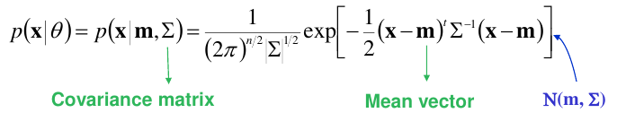

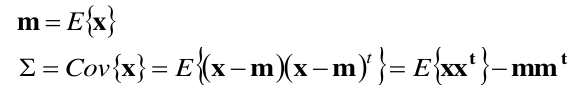

Keep in mind that since the covariance matrix is symmetric and positive semidefinite, the eigenvalues are positive and the eigenvectors form an orthogonal basis. It is also diagonal if the variables are independent, with the variance of each variable on the diagonal.

In the case of a 2D Gaussian PDF, considering $x_1$ and $x_2$ as the two features, there will be a third orthogonal axis which represents the probability of the data points, with a volume of 1. If we intersect this 3D volume with specific values of density (planes), we will get ellipses, representing the isolevels of that density. The ellipses axes are directed along the eigenvectors of the covariance matrix: the eigenvector associated with the largest eigenvalue is the direction of the major axis of the ellipse, while the eigenvector associated with the smallest eigenvalue is the direction of the minor axis.

If the main and minor axes are parallel to the original axes it means that the variables are uncorrelated. If the main axis has a positive slope, the variables are positively correlated, otherwise negatively correlated. If the variables are fully correlated, you only have a line instead of an ellipse, so the gaussian is flat in the direction of the correlation.

The same holds for n-dimensional Gaussian PDFs.

If we feed the ML estimator with a vector of training samples and the assumption that the data is Gaussian distributed, we get the ML estimate of the mean vector and the covariance matrix. 

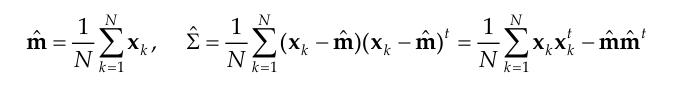

which are asymptotically unbiased and efficient, and consistent, with 

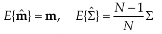

If you want directly a unbiased estimator for the covariance matrix: 

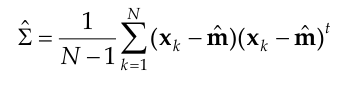

In the case of the poisson distribution, the ML estimator is the sample mean, which is asymptotically unbiased and efficient, and consistent.

# Bayesian Estimation

Here, the parameters $\theta_i$ are random variables with a known prior distribution, and thanks to the training data, we are able to update the distribution on these variables into a posterior probability density.

We know the density ($p(x|\theta)$), but we don't know $\theta$. The initial knowledge about $\theta$ is represented by a prior density $p(\theta)$, because the model is parametric and we know the distribution. The rest of the knowledge is contained in the training data $X$ distributed according to the unknown density $p(x)$. 

So, normally we would define $\hat\theta=\argmax_\theta{p(\theta)}$ where $\theta$ represents the parameters that maximize the know distribution $p(\theta)$, but it does not mean that the parameters that maximize the prior distribution are the best parameters for the model; this is the reason we also make use of the collection of training samples $X$, in order to update $\hat\theta$ to $\hat\theta=\argmax_\theta{p(\theta|X)}$, because we want to find the best parameters knowing the observed data $X$. When the number of training samples tends to infinity, the posterior distribution will converge to an impulse, removing the uncertainty and leaving only the best parameters.

We want to change from the prior distribution $p(\theta)$ to the posterior distribution $p(\theta|X)$.

$\hat p(x|X) = \int p(x,\theta|X) d\theta = \int p(x|\theta,X) p(\theta|X) d\theta$

But because we know $\theta$, the training samples $X$ are redundant useless, so we can write:

$\hat p(x|X) = \int p(x|\theta) p(\theta|X) d\theta$

In other words, what we are doing are summing up all the models, but this sum is a weighted sum, where the weights are the posterior probabilities $p(\theta|X)$, so the closer the model is to the training samples, the higher the weight.

If the number of training samples tends to infinity, the posterior will be picker up to a Dirac delta function.

Using marginalization, we can rewrite $p(\theta|X)$ as:

$p(\theta|X) = \frac{p(\theta,X)}{p(X)} = \frac{p(X|\theta) p(\theta)}{p(X)}$

where $p(X)$ is the marginal likelihood (like the numerator, but integrating over all possible values of $\theta$), $p(X|\theta)$ is the likelihood function ($\prod_{i=1}^N p(x_i|\theta)$), and $p(\theta)$ is the prior distribution.

You know the model, you know the prior distribution, you have the training samples, so you can compute the posterior distribution.

In the case of a univariate Gaussian distribution, the mean you are looking for is a trade-off between the actual mean of the training samples and the prior mean, each weighted by the corresponding variance.

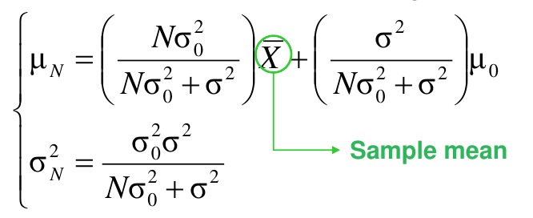

## ML vs Bayesian Estimation

In the bayesian estimation you have 2 sources of information: the training sample and the prior distribution; if the prior distribution is flat (no relevant information), the posterior distribution will be the same as the ML estimation. They are also equal when both tends to infinity because they both are asymptotically consistent (no bias nor variance).

In general, ML is preferred over Bayesian estimation because is conceptually and computationally simpler and easier to interpret. However, Bayesian estimation is helpful when you have prior knowledge about the parameters, and it is also useful when you have a small number of training samples.

# Nonparametric Estimation

When we don't know the shape of the data we are dealing with, we can use nonparametric estimation: in this case we don't have any parameters with we can deal with, so we have to use the training samples to estimate the density function (instead of computing a model $p(x|\theta)$ we then use to compute $\hat p(x)$, now the last one is computed directly).

Two methods are available: K-nearest neighbors and Parzen windows.

## Basic concepts

We assume the true unkonwn pdf $p(x)$ is a continuous function and $x^*$ a point in the feature space inside a prediction region $R$: for example, if $R$ is a bubble and $x^*$ lies inside the bubble, we want to compute the probability of that region.

If $R$ is small enough, which means that $p(x)$ does not vary significantly in $R$, we can approximate the probability of $R$ as the probability of $x^*$, so we can write:

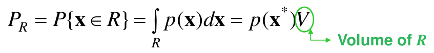

When we have many training samples, this probability can be directly computed as the fraction of training samples that lie inside $R$ over the total number of training samples ($\frac{k}{N}$), a good estimator.

Since these two probabilities are equal, we can write $p(x^*)V = \frac{k}{N}$, and after moving the $V$ to the other side, we get $p(x^*) = \frac{k}{NV}$, the starting point of the K-NN or Parzen window methods.

In the case of K-NN you fix K, you compute the volume that contains K training samples and then you compute $p(x^*)$.

In the case of Parzen window,you fix the volume $V$, you compute the number of training samples that lie inside $V$ and then you compute $p(x^*)$.

## K-Nearest Neighbors

We need to set K and decide the shape of the volume that will be centered in $x^*$: starting from it, you want to include in your volume exactly K training samples (the closest to the center of the volume); once you have the volume, you compute $p(x^*)$. When $N$ tends to infinity, also $K$ tends to infinity, but in order to have a good estimate, $K$ needs to be significantly smaller than $N$, so that  $\lim_{N\to\infty} \frac{K}{N} = 0$.

## Parzen Window

We need to fix the volume $V$ and we count the number of training samples that lie inside $V$; in this case we assume the shape of the volume is an hypercube with $h$ the side of the hypercube.

In order to count K we define a window function $\gamma (x)$ that is 1 if $x$ is inside the hypercube and 0 otherwise. A training sample $x_k$ belong to the hypercube if $\gamma((x_k-x^*)/h) = 1$, otherwise it is outside the hypercube and equal to 0.

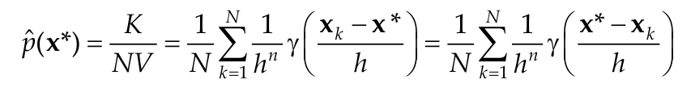

Basically, you are doing a convolution (interpolation) between the window function and the training samples, and then you normalize the result by dividing it by the volume of the hypercube.

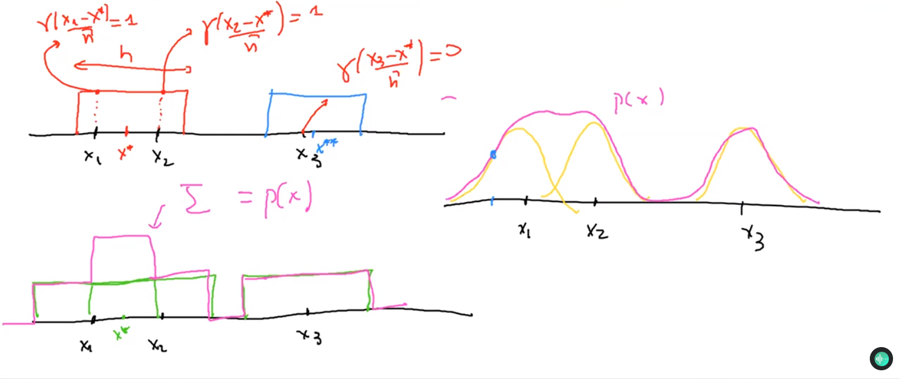

Instead of using $\gamma$ as a window function, you can use other functions, like a Gaussian, which is smoother. 

In order to use other functions, $\gamma$ should be non-negative and being a density function (it should integrate to 1); moreover, to get a good estimate, $\gamma$ would take a maximal value at the center of the hypercube, and it would decrease as you move away from the center, along being continuous and tend to 0 when $x$ is far away from the center.

The length of the edge should be chosed wisely, because if it is too small you will be able to detect fluctuations in the data, but risk to overfit the data; if it is too large, you will have a smoother distribution, but risk to underfit the data.

The expected value of the Parzen window estimator is:

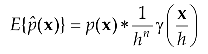

which is a blurred version of the true density function, since a convolution is applied. It is still biased, but not asymptotically if the kernel width is chosen wisely.

Speaking about the variance, it is not possible to compute it precisely, but we can compute an upper bound: the variance describes the incertainty, so if you want to reduce the incertainty, the upper bound should be as small as possible, and this happen when the number of training samples tends to infinity, so there is no more incertainty.

When the number of training samples tends to infinity, the length of the edge doesn't matter anymore, because the distribution will be the actual one.

### Gaussian Kernel

One of the most used kernel is the Gaussian kernel, which is a function of the form:

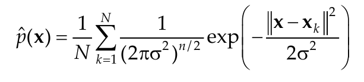 

Here, the standard deviation $\sigma$ represents the width of the kernel, acting like a smoothing parameter. A possible approach is to choose $\sigma$ in an adaptive way, associating a standard deviation to each training sample: for example, considering the $K$ closest training samples to the actual one, you can compute the mean Euclidean distance between them and use it as the standard deviation of the Gaussian kernel; in this way, the Gaussian kernel will be picker in the regions where the training samples are more dense.

# Estimation with Incomplete Data

It may happen that some training samples are **missing some features**, and we need to estimate them, or there are some **unknown latent variables** (like some parameters) that we need to estimate. In this case, we can use the EM algorithm.

If we have $N$ observations in a n-dimensional space, and these observations are generated by a mixture of $M$ Gaussian distributions with $p(x)=\sum_{i=1}^M P_i N(x|m_i, \Sigma_i)$. So the parameters vector contains $P_i$, $m_i$ and $\Sigma_i$ for each Gaussian distribution, and the total number of parameters is $3M$. But, when we examine a training sample, we don't know which mode is associated with it. What we know is just the samples from the general distribution $p(x)$, along with the fact that there is a relationship of the summation type between the different (hidden) modes.

In this case, part of the dataset is missing, so we just add it, defining $Z=(X,Y)$, where  $Y$ represents the missing data.

Making use of the joint density function 

$p(Z|\theta)=p(X,Y|\theta)=p(Y|X,\theta)p(X|\theta)$

the complete-data likelihood is just $l(\theta|Z)=p(Z|\theta)=p(X,Y|\theta)$ (**random function**) while the incomplete-data one is $l(\theta|X)=p(X|\theta)$ (**deterministic function**).

The EM algorithm is composed of two steps:

1. **E-step**: given the current estimate of the parameters $\theta^{(k)}$, we compute the conditional expectation $Q(\theta,\theta^{(k)})$ of $log(p(X,Y|\theta))$:

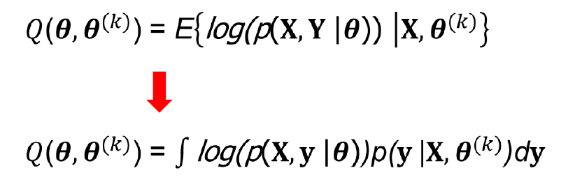

2. **M-step**: we find the $\theta$ that maximize $Q(\theta,\theta^{(k)})$ to obtain the new estimate $\hat\theta^{(k+1)}$.

The algorithm is not guaranteed to converge to a global maximum, it may stop at a local maximum or at a saddle point.