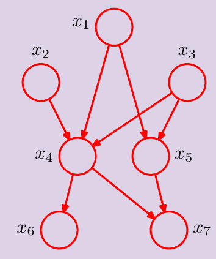
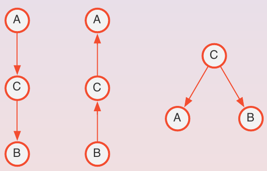

# Bayesian Networks

Bayesian networks are graphical models used in order to represents probability distribution across different variables. They help decouple the qualitative aspect from the quantitative one: the first one is represented by the graph, from which we can infer the dependencies between the variables, while the second one is represented by the actual probabilities. Moreover, some algorithms can be used to infer the probability distribution of a variable given the values of some other variables.

A BN is a directed acyclic graph (DAG) where each node represents a random variable and each edge represents a dependency between two variables. In a BN, each node is independent from its non-descendants, given its parents:

Here, speaking about $x_4$, its non-descendants are $x_1$, $x_2$, $x_3$ and $x_5$, but the first three are also parents of $x_4$, so $x_4$ is independent from $x_5$ given $x_1$, $x_2$ and $x_3$.

If there are some independencies in your data, you can use a BN to represent them if the local independencies carried by the graph hold in the actual data: the graph is also defined as a **independency map (I-map)**, because everything that holds in the graph also holds in the actual data, and it could be the same or a subset of the actual independencies.

In this way, the probabilities can be decomposed according to the graph, and the joint probability distribution can be written as: $$P(x_1, ..., x_5) = \prod_{i=1}^m P(x_i | pa(x_i))$$ where $pa(x_i)$ is the set of parents of $x_i$, reducing the complexity of the computation (instead of computing all the other variables, we can compute only the ones that are parents of the variable we want to compute).

## d-separation

In probability, two variables are independent if $$P(a, b) = P(a)P(b)$$ and conditionally independent given another variable $z$ if $$P(a,b|c) = P(a|c)P(b|c)$$

There are three different types of connections between two variables $a,b$ in a BN:

- **Tail-to-tail**: $a$ and $b$ share a common parent $c$. Not independent, but conditionally independent given $c$. Joint probability distribution can be written as $P(a,b,c) = P(a|c)P(b|c)P(c)$

- **Head-to-tail**: $a$ is a parent of $c$, which is a parent of $b$. Not independent, but conditionally independent given $c$. Joint probability distribution can be written as $P(a,b,c) = P(b|c)P(c|a)P(a)$

- **Head-to-head**: $a$ and $b$ are parents of $c$. Independent, but not conditionally independent given $c$. Joint probability distribution can be written as $P(a,b,c) = P(c|a,b)P(a)P(b)$ 

Given three nonintersecting sets $A$, $B$ and $C$, we say that $A$ and $B$ are **d-separated** by $C$ if all paths between $A$ and $B$ are blocked: this happens when there is at least one node in the path with **tail-to-tail** or **head-to-tail** connections and it is in $C$, or with **head-to-head** connections and neither $C$ nor any of its descendants are known (**Markov blanket**).

So in a BN there are both **local** ($\forall i \space x_i \perp NonDesc_{x_i}|Pa_{x_i}$) and **global** ($(A \perp B|C):dsep(A;B|C)$) (Markov) independencies.

## I-equivalence, I-map and P-map

Two BNs are **I-equivalent** if they have the same independencies.

In the previous example, it doesn't matter if the three BNs are different, at the end they model the fact that $A$ and $B$ are dependent, and become independent if $C$ is known.

A BN is an **indipendency map (I-map)** if it is **I-equivalent** to the actual data. It is also **minimal** if it is not possible to remove any node or edge without making it not I-equivalent to the actual data. It is a **perfect map (P-map)** if it captures all the independencies in the data, not only a subset of them.