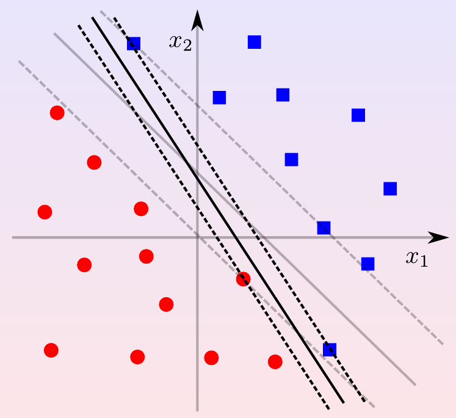
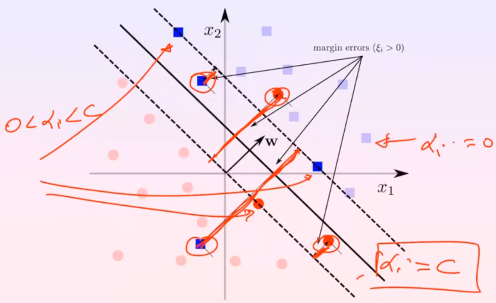

# Support Vector Machines

## Hard Margin SVM

Support Vector Machines (SVMs) are discriminative linear classifiers whose hyperplane maximize the separation margin between classes (**large margin classifiers**). Only a subset of the training data, called **support vectors**, are used to define the hyperplane, the closest to the hyperplane. 

The *confidence margin* is $\rho = \min_{(x,y) \in D} yf(x)$, the minimal confidence margin for predicting the true label, while the *geometric margin* is the normalization of the previous one: $\frac{\rho}{||w||} = \min_{(x,y) \in D} \frac{yf(x)}{||w||}$

Based on the parameters, there are infinte number of parameters that define the same hyperplane (if $w^Tx+w_0=0$, also every multiple of $w$ and $w_0$ defines the same hyperplane). To remove this ambiguity, it is possible to set the confidence margin to 1, called **canonical hyperplane**, with its geometric margin $\frac{1}{||w||}$.

The optimization problem is (**primal formulation**):

$$\begin{align*}\max_{w} \frac{2}{||w||}\rarr\min_{w} \frac{1}{2}||w||\rarr\min_{w} \frac{1}{2}||w||^2\end{align*}$$

$$\begin{align*} \text{ subject to } y_i(w^Tx_i+b) \geq 1,  \forall (x_i,y_i) \in D\end{align*}$$

with $w$ squared to remove square root from the norm.

## **!!MARGIN ERROR BOUND!!**

This problem is a quadratic optimization problem with linear constraints, and it is proved that it is convex, so it has a unique global minimum.

### Karush-Khun-Tucker (KKT)

To resolve this problem, KKT approach is used to tranform the problem from a constrained optimization problem to an unconstrained one with the same solution. It says that a problem like this:

$$\begin{align*}\min_{z} f(z) \text{ subject to: } g_i(z) \geq 0 \space \forall i \end{align*}$$

can be transformed to an unconstrained problem adding non-negative variables $\alpha_i \geq 0$, called **Lagrange multipliers**, to each constraint and rewriting the problem as (Lagrangian):

$$\begin{align*}\min_{z}\max_{\alpha \geq 0} f(z) - \sum_{i} \alpha_i g_i(z) \end{align*}$$

minimizing wrt the primal variable $z$ and maximizing wrt the dual variables $\alpha$. 

This works because if there is one constraint not satisfied (i.e. $g_i(z) < 0$), then the dual problem can be resolved by setting $\alpha_i$ to infinity; if all the constraints are satisfied, maximizing the dual problem will set the subtracted summation to zero, leaving only the primal problem.

Rewriting SVM problem in this form, we have:

$$L(w, w_0, \alpha) = \frac{w^Tw}{2}- \sum_{i=1}^m \alpha_i[y_i(w^Tx_i+w_0)-1]$$

that is going to be minimized wrt $w, w_0$ and maximized wrt $\alpha$, obtaining a saddle point, the solution of the problem.

Calculating the gradient of $L$ with respect to $w$ and $w_0$ and setting it to zero, we obtain:

$$\nabla_w L = w - \sum_{i=1}^m \alpha_i y_i x_i = 0 \rarr w = \sum_{i=1}^m \alpha_i y_i x_i\\ \frac{\partial L}{\partial w_0} L = - \sum_{i=1}^m \alpha_i y_i = 0 \rarr \sum_{i=1}^m \alpha_i y_i = 0$$

Rewriting the problem with new $w$: 

$$\frac{1}{2}(\sum_i \alpha_i y_i x_i)^T(\sum_j \alpha_j y_j x_j) - \sum_{i=1}^m \alpha_iy_ix_i^T(\sum_j \alpha_j y_j x_j) - \sum_{i=1}^m \alpha_iy_i w_0 + \sum_{i=1}^m \alpha_i$$

After some algebraic manipulation, we obtain:

$$\frac{1}{2}\sum_i\sum_j \alpha_i \alpha_j y_i y_j x_i^T x_j - \sum_i\sum_j \alpha_i y_i \alpha_j y_j x_i^T x_j - w_0 \sum_i \alpha_i y_i+ \sum_i \alpha_i$$

Because the first and the second term are the same and $\sum_i \alpha_i y_i = 0$, we obtain:

$$-\frac{1}{2}\sum_i\sum_j \alpha_i \alpha_j y_i y_j x_i^T x_j + \sum_i \alpha_i$$

which is the **dual formulation** of the problem:

$$\begin{align*}\max_{\alpha} \sum_{i=1}^m \alpha_i - \frac{1}{2}\sum_{i=1}^m\sum_{j=1}^m \alpha_i \alpha_j y_i y_j x_i^T x_j \\ \text{ subject to: } \alpha_i \geq 0 \space i = 1, \dots, m \space \sum_{i=1}^m \alpha_i y_i = 0\end{align*}$$

One can choose which formulation to use according to the number of variables ($d+1$ features for primal, $m$ training samples for dual).

Substituting $w$ in the decision function, we obtain:

$$f(x) = w^Tx + w_0 = \sum_{i=1}^m \alpha_i y_i x_i^T x + w_0 $$

At the end, the decision function, is a linear combination of dot products of each training example and the example to be predicted, summed up all together.

Here, the dot-product acts like a similarity measure, between $x_i^T$ and $x$, $y_i$ the label whose $x_i$ is pulling (making the dot product positive) and $\alpha_i$ describing the strength of the contribution.

### KKT conditions

Speaking about the Lagrangian $$L(w, w_0, \alpha)=\frac{1}{2}||w||^2- \sum_{i=1}^m \alpha_i[y_i(w^Tx_i+w_0)-1]$$

the saddle point, the solution of the problem, is obtained when $$\alpha_i[y_i(w^Tx_i+w_0)-1] = 0$$

Here are two cases:

- $\alpha_i = 0$: the example not contribute to the decision function
- $\alpha_i > 0$ and $y_i(w^Tx_i+w_0)-1 = 0$: the example is on the minimal confidence margin

This means that the only examples that contribute to the decision function are the ones on the margin, only a few of them. This is the reason why SVMs are called **sparse**.

To calculate the bias $w_0$ we can choose any example on the margin (or averaging all of them), and calculate $w_0$ from $y_i(w^Tx_i+w_0) = 1$, obtaining $w_0 = \frac{1-y_i(w^Tx_i)}{y_i}$.

## Soft margin SVM

As shown in the figure, the hard margin SVM is very sensitive to outliers, and the SVM will not generalize well, producing a small margin, that can lead to wrong predictions., like in the case of a new *blue box* closed to the top-left one. Instead, if the bottom-right *blue box* could be misclassified, the margin would be larger and the new *blue box* will be classified properly.

In order to do that, we can introduce a slack variable $\xi_i \geq 0$ for each example, that will be used to penalize misclassified examples. The new objective function is:

$$\min_{w, w_0, \xi} \frac{1}{2}||w||^2 + C \sum_{i=1}^m \xi_i \\ \begin{align*} \text{ subject to: } y_i(w^Tx_i+w_0) \geq 1 - \xi_i \space \xi_i \geq 0 \space i = 1, \dots, m\end{align*}$$

where $C$ is a regularization hyperparameter, that controls the trade-off between the margin and the number of misclassified examples. The larger $C$ is, the more the SVM will try to fit the training set without errors, and the smaller the margin will be. 

$\xi_i$ is set to 0 if the example is correctly classified, otherwise it is set to the distance between the decision boundary and the example ($1-y_if(x_i)$). So basically, the slack variables are just the name given to the Hinge Loss in the SVM.

Converting the problem using the Lagrangian, we obtain:

$$L = \frac{w^Tw}{2} + C \sum_{i=1}^m \xi_i - \sum_{i=1}^m \alpha_i[y_i(w^Tx_i+w_0) - 1 + \xi_i] - \sum_{i=1}^m \beta_i \xi_i$$ 

Calculating the gradient gives:

$$ \nabla_w L = w - \sum_{i=1}^m \alpha_i y_i x_i = 0 \rarr w = \sum_{i=1}^m \alpha_i y_i x_i \\
\frac{\partial L}{\partial w_0} = - \sum_{i=1}^m \alpha_i y_i = 0 \rarr \sum_{i=1}^m \alpha_i y_i = 0 \\
\frac{\partial L}{\partial \xi_i} = C - \alpha_i - \beta_i = 0 $$

As above, what we get is:

$$-\frac{1}{2}\sum_i\sum_j \alpha_i \alpha_j y_i y_j x_i^T x_j + \sum_i \xi_i(C-\alpha_i-\beta_i) - \sum_i \alpha_i y_i w_0 + \sum_i \alpha_i$$

with the second and third terms being equal to 0.

Speaking about the constraints we have $\alpha_i \geq 0 \space\space \beta_i \geq 0 \space\space C - \alpha_i - \beta_i = 0$, but since $\beta_i \geq 0$, we can write $\alpha_i \leq C$.

Now the dual formulation is:

$$\max_{\alpha} \sum_{i=1}^m \alpha_i - \frac{1}{2}\sum_{i=1}^m\sum_{j=1}^m \alpha_i \alpha_j y_i y_j x_i^T x_j \\ \text{ subject to: } 0 \leq \alpha_i \leq C \space i = 1, \dots, m \space \sum_{i=1}^m \alpha_i y_i = 0 $$

At the saddle point:

$$\alpha_i[y_i(w^Tx_i+w_0) - 1 + \xi_i] = 0 \\ \beta_i\xi_i=0 $$

This means that support vectors are not only the ones on the margin ($y_i(w^Tx_i+w_0) = 1$), but also the ones inside the margin or misclassified ($y_i(w^Tx_i+w_0) \lt 1$).

We can distinguish two cases:

- $\alpha_i \lt C, \space C-\alpha_i-\beta_i = 0$ and $\beta_i\xi_i=0$ implies $\xi_i = 0$: unbound support vector, on the margin

- $\alpha_i = C$: bound support vector, with $\xi_i \gt 0$, margin errors (or even misclassification errors)

## Large-scale SVM (Pegasus)

When the dataset is large, computing the gradient over all the examples is very expensive. Instead, we can use a stochastic gradient descent (SGD) approach, that will update the parameters after each example, and will converge to the same solution.

The idea is to use a mini-batch of $B$ examples, and update the parameters after each mini-batch. The SVM formulation becomes:

$$ \min_{w \in X} \frac{\lambda}{2}||w||^2 + \frac{1}{m} \sum_{i=1}^m \max(0, 1-y_i(w^Tx_i+w_0)) $$

where the objective function for a single example is:

$$ \frac{\lambda}{2}||w||^2 + \max(0, 1-y_i(w^Tx_i+w_0)) $$

with subgradient (subgradient is used because Hinge Loss is not differentiable at 0, so we choose one among the possible ones):

$$\nabla_w E = \lambda w - 1[y_i(w,x_i)<1]y_ix_i$$

with the indicator function $1[y_i(w,x_i)<1]$ returning 1 if we are coming from the left side of the Hinge Loss, and 0 otherwise.

At this point, we can use SGD to update $w$:

$$w_{t+1} \leftarrow w_t - \eta \nabla_w E$$

where $\eta=\frac{1}{\lambda t}$ is the learning rate, and $t$ is the iteration number and $\nabla_wE$ is the subgradient of one random example.

