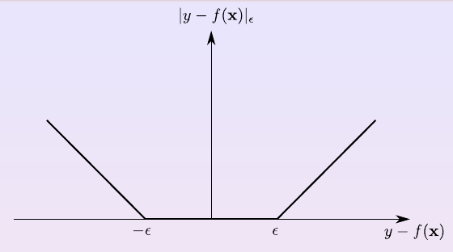
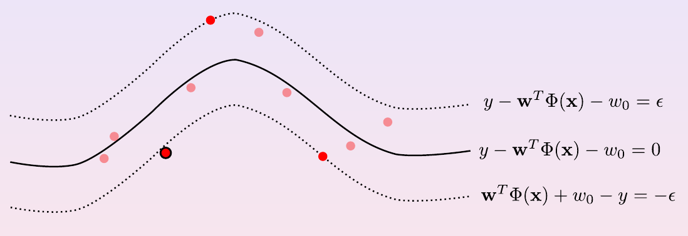
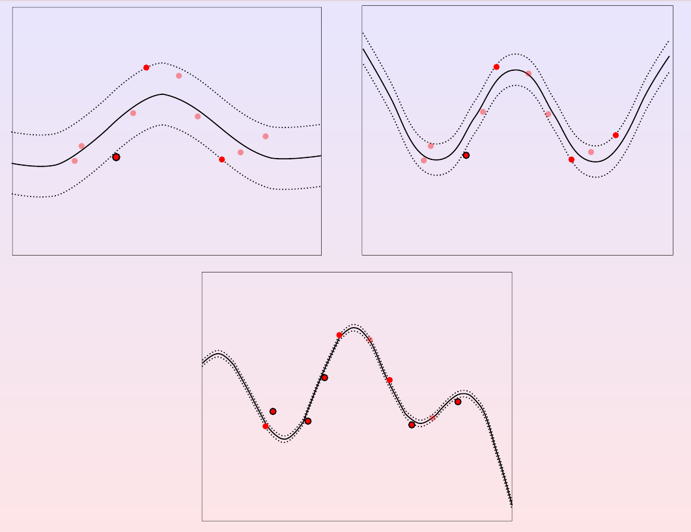

# Non-Linear SVM

Sometimes, the data cannot be separated by a linear classifier, but with some tricks it is possible to solve it with a SVM, with all its advantages. This is done by mapping the data to a higher dimensional feature space (combining features), where it can be separated by a linear classifier.

In order to do that, a feature mapping function $\Phi$ is used, which maps the original features to a higher dimensional space with more feature expressivity, substituting the original examples $x$ by the new features $\Phi(x)$.

There are two types of feature map:
- Homogeneous (of a certain degree): $\Phi(x_1, x_2) = (x_1^2, x_1x_2, x_2^2)$
- Inhomogeneous (up to a certain degree ): $\Phi(x_1, x_2) = (x_1, x_2, x_1^2, x_1x_2, x_2^2)$

The new decision function becomes $f(x)=w^T\Phi(x)+w_0$, like $f(x_1, x_2)=sgn(w_1x_1^2+w_2x_1x_2+w_3x_2^2+w_0)$, where it describes an a hyperplane in the feature space, but an ellipsoid in the input space (non-linear).

## Support Vector Regression

The SVM can also be used for regression, by using the same principles as in the classification case, but with a different loss function to get a smooth and sparse solution.

The loss function is called $\epsilon$-insensitive loss function, and is defined as:

$$
\begin{align*}
\mathcal{l}(y, f(x)) = \begin{cases}
0 & \text{if } |y-f(x)| \leq \epsilon \\
|y-f(x)| - \epsilon & \text{otherwise}
\end{cases}
\end{align*}
$$

In this way you can adapt the $\epsilon$ value to the problem, getting more or less tolerance to support vectors.

So, the optimization problem becomes:

$$ \min_{w, b} \frac{1}{2}||w||^2 + C \sum_{i=1}^N (\xi_i + \xi_i^*) \\ \text{subject to } y_i - f(x_i) \leq \epsilon + \xi_i \\ f(x_i) - y_i \leq \epsilon + \xi_i^* \\ \xi_i, \xi_i^* \geq 0 $$

where $\xi_i$ and $\xi_i^*$ are the slack variables for the upper and lower bound, respectively, and $f(x_i) = w^T\Phi(x_i) + w_0$.

Now, using Lagrange multipliers, the dual problem becomes:

$$ L = \frac{||w||^2}{2} + C \sum_i(\xi_i + \xi_i^*) - \sum_i \alpha_i (\epsilon + \xi_i - y_i + w^T\Phi(x_i) + w_0) - \sum_i \alpha_i^* (\epsilon + \xi_i^* + y_i - w^T\Phi(x_i) - w_0) - \sum_i \beta_i \xi_i - \sum_i \beta_i^* \xi_i^* $$ 

where everything which is multiplied by $\alpha_i$ and $\alpha_i^*$, are the contraints arranged to be expressed as something $\geq 0$, and $\beta_i$ and $\beta_i^*$ are the Lagrange multipliers for the slack variables.

Taking the gradient of $L$ with respect to $w$ and $w_0$ and setting it to zero, we get:

$$ \nabla_w L = w - \sum_i \alpha_i \Phi(x_i) + \sum_i \alpha_i^* \Phi(x_i) = 0 \rarr w = \sum_i (\alpha_i - \alpha_i^*) \Phi(x_i)$$

$$ \frac{\partial L}{\partial w_0} = - \sum_i \alpha_i + \sum_i \alpha_i^* = 0 \rarr \sum_i (\alpha_i^* - \alpha_i) = 0 $$

$$ \frac{\partial L}{\partial \xi_i} = C - \alpha_i - \beta_i = 0 $$

$$ \frac{\partial L}{\partial \xi_i^*} = C - \alpha_i^* - \beta_i^* = 0 $$

Substituting this in the original problem, we get:

$$ \sum_i \xi_i^* (C-\alpha_i^*-\beta_i^*) + \sum_i \xi_i (C-\alpha_i-\beta_i) + \sum_i w_0(\alpha_i^*-\alpha_i) + \frac{1}{2} w^Tw + \sum_i w^T\Phi(x_i)(\alpha_i^*-\alpha_i)$$

With the first three terms being zero, and substituting w, we get:

$$ \frac{1}{2} \sum_i (\alpha_i-\alpha_i^*)\Phi(x_i)^T + \sum_j (\alpha_j-\alpha_j^*)\Phi(x_j) - \sum_i \sum_j (\alpha_j-\alpha_j^*)\Phi(x_j)^T\Phi(x_i)(\alpha_i-\alpha_i^*)$$

and after combining it and put it all together, we get:

$$-\frac{1}{2}\sum_i\sum_j(\alpha_i-\alpha_i^*)(\alpha_j-\alpha_j^*)\Phi(x_i)^T\Phi(x_j) - \epsilon\sum_i(\alpha_i+\alpha_i^*) + \sum_iy_i(\alpha_i-\alpha_i^*) \\ \text{subject to } \sum_i(\alpha_i-\alpha_i^*) = 0$$

Speaking about the decision function, it becomes $f(x)=w^T\Phi(x)+w_0 = \sum_i (\alpha_i - \alpha_i^*) \Phi(x_i)^T\Phi(x) + w_0$

## Karush-Kuhn-Tucker conditions

Speaking about the constraints, as in the soft-margin SVM, from $C-\alpha_i-\beta_i=0$, $\alpha_i \geq 0$ and $\beta_i \geq 0$, we get $$0 \leq \alpha_i \leq C$$ and from $C-\alpha_i^*-\beta_i^*=0$, $\alpha_i^* \geq 0$ and $\beta_i^* \geq 0$, we get $$0 \leq \alpha_i^* \leq C$$

When $\alpha_i=0$ and $\alpha_i^*=0$, the corresponding $x_i$ is not a support vector, when $0 \lt \alpha_i \lt C$ ($\xi_i=0\rarr\alpha_i\gt0\rarr\epsilon+y_i-f(x_i)=0\rarr f(x_i)-y_i=\epsilon$) and $0 \lt \alpha_i^* \lt C$, the corresponding $x_i$ is a unbound support vector, and when $\alpha_i=C$ ($\xi_i=0\rarr\beta_i=0\rarr\alpha_i=C$) and $\alpha_i^*=C$, the corresponding $x_i$ is a bound support vector.

Light red points are not support vectors, red points are unbound support vectors, and red points with a black circle are bound support vectors.

If $\epsilon$ is reasonably big, the number of support vectors is small and the regression line will be smooth. More small $\epsilon$ is, more support vectors will be used and the regression line will be more wiggly and more picky about the data points. Not only $\epsilon$ affects the number of support vectors, but also the value of $C$, so both hyperparamers can be tuned to get the best result.

