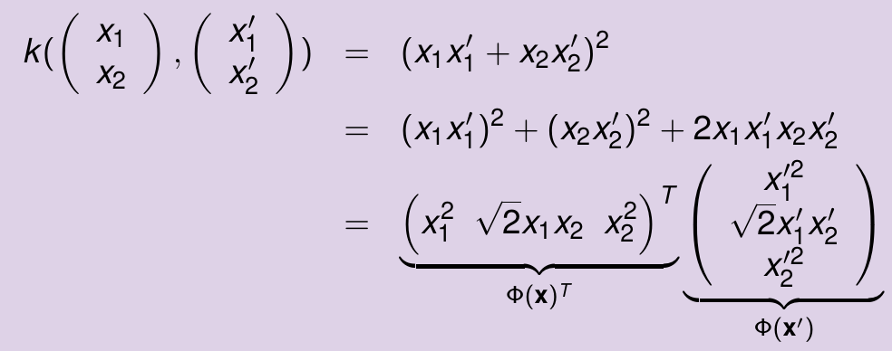
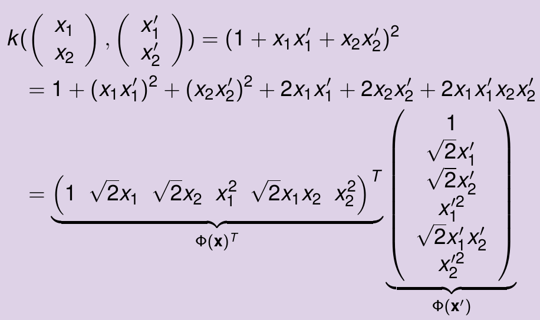

# Kernel Machines

When a problem is non-linear, feature mapping can be used to transform the data into a higher dimensional space where it becomes linearly separable. A problem with this procedure is the fact that it can be computationally expensive to compute $\Phi(x)$ over and over again, when they are multiplied together with the dot product in dual formulation: to avoid this, it is possible to use the kernel trick, replacing the dot product with an equivalent kernel function $K(x,x')= \Phi(x) \cdot \Phi(x')$, using examples in input space, and avoiding the need to convert them into the feature space (it is done implicitly, thanks to kernel function).

In case of homogeneous feature mapping the kernel becomes $$k(x,x')=(x^Tx')^d$$ which is the dot product in feature space, raised to the power of $d$. 

In case of inhomogeneous feature mapping the kernel becomes $$k(x,x')=(1+x^Tx')^d$$ which is the dot product in feature space plus one, raised to the power of $d$.

A valid kernel is defined as a function $k: X \times X \rarr \mathbb{R}$ such that k is symmetric and $k(x,x')=\Phi(x)^T \cdot \Phi(x')$. The kernel also generalizes the dot product in arbitrary input space (vectors, sequencies, graphs) and can be seen as a measure of similarity between two points in the input space.

In order for a kernel to correspond to a valid feature mapping, the necessary and sufficient condition is that the kernel is positive definite, which means it is a function that gives rise to a positive definite Gram matrix for any example. The Gram matrix is a matrix of pairwise kernel between all pairs of examples in the training set and it is positive definite when $\sum_{i,j=1}^m c_ic_jK_{ij} \geq 0 \space \forall c \in \mathbb{R}^m$ (or eigenvalues are non-negative or exists matrix $B$ such that $K=B^TB$).

Kernels can be applied also to regression SVM, but not only SVM: for example, there is a variant of the perceptron, called **Kernel Perceptron**, where you initialize $\alpha_i=0\space\forall_i$, and then you iterate until all examples are correctly classified; if an example is misclassified $\alpha_i\larr\alpha_i+\eta y_i$, with $y_i=\pm1$, so $\alpha_i\larr\alpha_i\pm\eta $

## Types of kernels

- Linear kernel: $k(x,x')=x^Tx'$;
- Polinomial kernel: $k_{d,c}(x,x')=(x^Tx'+c)^d$;
- Gaussian kernel: $k_{\sigma}(x,x')=exp(-\frac{||x-x'||^2}{2\sigma^2})=exp(-\frac{x^Tx-2x^Tx'+x'^Tx'}{2\sigma^2})$, where $\sigma$ is the width of the Gaussian, the smaller the $\sigma$ the more prediction depends on its nearest neighbors (universal kernel, you can approximate any arbitrary continuous function with it);
- Match (or delta) kernel: $k(x,x')=\delta(x,x')$, where $\delta(x,x')=1$ if $x=x'$ and $\delta(x,x')=0$ otherwise; typically used for structured data, like sequences, trees or graphs to measure the similarity of two objects;
- Spectrum kernel: feature space is space of all possible k-grams (substrings of length k) of the input string, and the kernel is the dot product between the two strings in this space;
- Weistfeiler-Lehman graph kernel: efficient graph kernel for large graphs, relying on Weistfeiler-Lehman test of graph isomorphism, with $k_{WL}^h(G,G')=\sum_{i=0}^hk(G_i,G_i')$ (sum is intended as concatenation), to compute graph similarity between two graphs.

## Kernel combination

It is possible to combine kernels in order to obtain a new kernel, which is useful when you want to design complex kernels on structures from simpler ones.

- Kernel Sum: $(k_1+k_2)(x,x')=k_1(x,x')+k_2(x,x')$; the two kernel can be defined on different spaces (string spectrum kernel plus string length);
- Kernel Product: $(k_1\cdot k_2)(x,x')=k_1(x,x')k_2(x,x')$; it can be between kernels in different spaces (tensor product);
- Linear combination: a kernel can be rescaled by an arbitrary positive constant $k_\beta(x,x')=\beta k(x,x')$; it is possible to define linear combinations of kernels $k_{sum}(x,x')=\sum_{k=1}^K \beta_k k_k(x,x')$ where kernel learning is also possible, by learning the weights $\beta_k$;
- Kernel normalization: kernel values can ofter be influenced by the dimension of objects (longer string $\rarr$ higher kernel value), so you can normalize the kernel by computing, for example, the cosine normalization $\hat{k}(x,x')=\frac{k(x,x')}{\sqrt{k(x,x)k(x',x')}}$; it's like computing cosine similarity in the feature space;
- Kernel composition: it is possible to define a kernel on the output of another kernel (all possible conjuctions of up to d k-grams substrings), for example $(k_{d,c}\circ k)(x,x') = (k(x,x')+c)^d$ or $(k_{\sigma}\circ k)(x,x')=exp(-\frac{k(x,x)-2k(x,x')+k(x',x')}{2\sigma^2})$;

