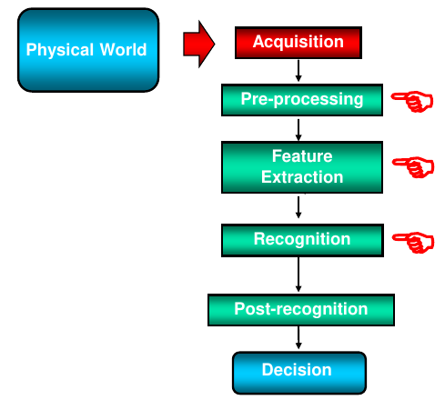
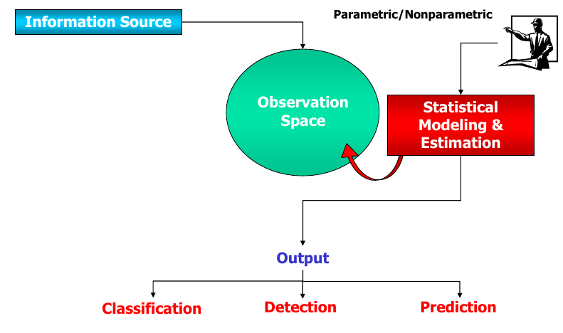
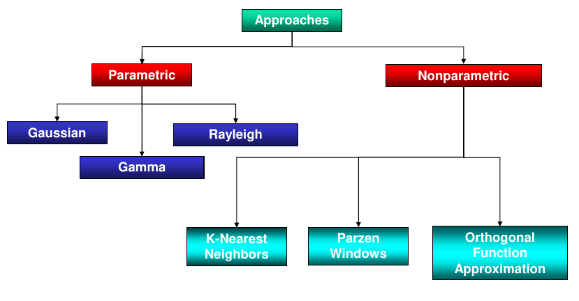
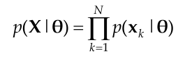

# Statistical Estimation Theory

## Introduction

Statistical estimation is an important part in machine learning, since you want to estimate the statistical distribution of the data you have, using only the subset of observations you have (samples).

In particular, this estimation can be necessary during pre-processing, in order to normalize the data, or during feature extraction, in order to extract the most important features, or during recognition, in order to estimate the probability of a given sample to belong to a certain class.

In general only some samples of the overall data are available, and with them we want to find a model that can be used to estimate the distribution of the whole data, model that could be parametric or non-parametric; after querying the model, we receive some output.

The information source from which the data is coming from, could be completely known, partially known or completely unknown, but in the real world, the last two cases are the most common.

In pratical terms, what we want to estimate is the probability density function (pdf) of the data.

## PDF Estimation

If we consider $x=(x_1, x_2, ..., x_n)$ as a vector of n features with unknown pdf $p(x)$ and $X=\{x_1, x_2, ..., x_n\}$ as a finite set of independent and identically distributed (iid) samples drawn from $p(x)$ called training samples, we want to determine an estimate $p̂(x)$ on the basis of the training samples $X$, that is close as possible to the true pdf $p(x)$.

Based on the approach we want to use, we can distinguish between parametric and non-parametric approaches.

## Parametric Estimation

We have a model $p(x)$ characterized by a set of parameters $\theta=(\theta_1, \theta_2, ..., \theta_n)$, written as $p(x|\theta)$, in order to express the dependence of the pdf on the parameters.

If we take $X$ as defined before (iid random variables), we can define a likelihood function as

This function describes the likelihood of the parameters $\theta$ given the training samples $X$, a measure of the compatibility between $\theta$ and $X$.

There are two main procedures to estimate the parameters $\theta$:

1. Maximum Likelihood Estimation (MLE): $\theta_i$ values are fixed but unknown, and the best estimate is the ove that maximizes the probability of obtaining the training samples $X$.

2. Bayesian Estimation: $\theta_i$ are random variables with a known prior distribution; thanks to the observations $X$, we can update the prior distribution to obtain the posterior distribution of $\theta_i$.

## Estimation Goodness

When calculating the parameters using the training samples, we want our estimatation $\hat\theta$ to be as close as possible to the true parameters $\theta$, or in other words, we want to minimize the estimation error (the difference between the true parameters and the estimated ones): ideally, we want each estimation error $\epsilon_i$ to be unbiased and without variance.

It is unbiased if if $\mathbb{E}[\epsilon_i]=0$, so $\mathbb{E}[\hat\theta_i]=\theta_i$.

Speaking about the variance, defined as $var(\epsilon_i)=\mathbb{E}[(\hat\theta_i-\theta_i)^2]$, in order to assess its goodness, it's easier to refer to Cramer-Rao lower bound (CRLB), which express a lower bound on the variance of the estimator $\hat\theta_i$, which should be unbiased.

In the reality is quite impossibile to obtain unbiased estimators, so, instead, we can try to collect as many data as possible, in order to reduce the variance of the estimator: in other words, the estimator is good if it is asympotically unbiased, asympotically efficient and consistent (iif asymptotically unbiased and variance converges to zero).

# Maximum Likelihood Estimation