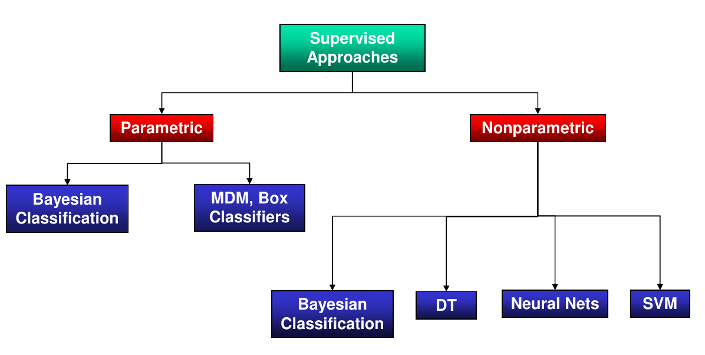
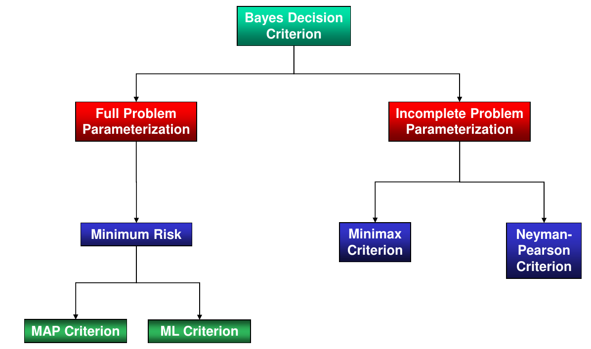
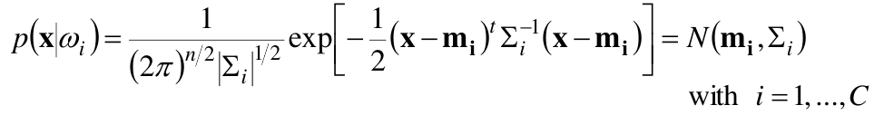
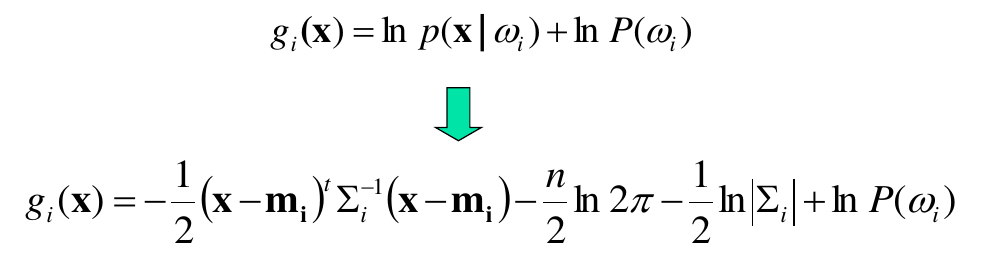
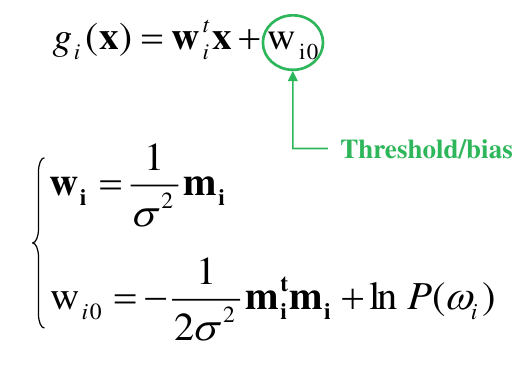
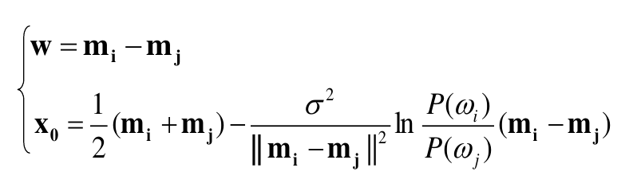
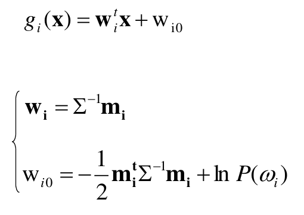
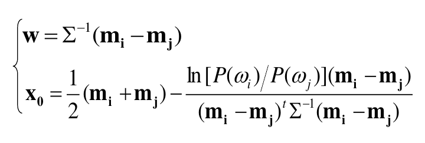
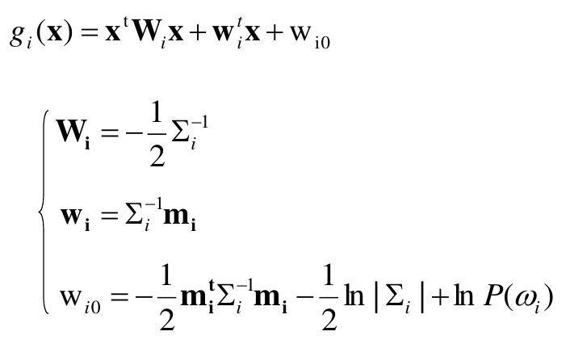
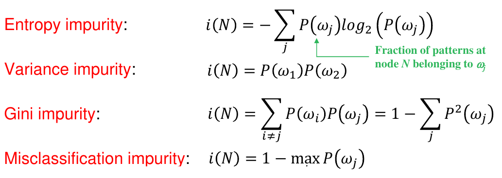

# Supervised Classification

## Introduction

The design of a supervised classifier depends on the available set of features and training samples, the type of the model and the cost function to be optimized. As already discussed, it makes use of the features to assign the training samples to a set of classes.

The models are divided into two categories:

## MDM Classifier (minimal-distance-to-means)

This classifier usually works when the classes are very compact, with a small (co)variance, up to the point they can be considered as a single point, the mean of the class. When a new unlabeled sample is presented, the distance between the sample and the mean of each class is calculated; the class with the smallest distance is assigned to the sample. At the end there are only linear decision bounderies (the axis of the polygon connecting the means of the classes).

## Box Classifier

It is a generalization of the MDM classifier, where the classes barycenters are kept as the means of the classes, but now the size of the classes are proportional to the variance of the classes ($\alpha*\sigma_{ij}$)

## Bayesian Classification

It is a statistical approach to classification, where the probability of a sample to belong to a class is calculated, and the class with the highest probability is assigned to the sample.

Based on the parameterization of the problem, the Bayesian classifier can be divided into two categories:

## MAP Criterion

In this case you already know the posterior probability of the classes and when a new sample is presented, it is assigned to the class that maximizes the posterior probability, while minimizing the error probability.

Since the posterior probability are often unknown, it is easy to rewrite the MAP criterion using the Bayes theorem ($p(x)$ is omitted since it is the same for all classes):

$$ \hat\omega = \argmax_{\omega_i} P(\omega_i|x) = \argmax_{\omega_i} P(x|\omega_i)P(\omega_i) $$

The error can be espresed as:

$P(error) = P(error|\omega_1)P(\omega_1) + P(error|\omega_2)P(\omega_2) = \int_{T}^{+\infin}{p(x|\omega_1)dx}P(\omega_1) + \int_{-\infin}^{T}{p(x|\omega_2)dx}P(\omega_2) = \int_{-\infin}^{+\infin}{p(x|\omega_1)dx}P(\omega_1) + \int_{-\infin}^{T}{p(x|\omega_2)P(\omega_2)dx} = \int_{-\infin}^{T}{p(x|\omega_2)P(\omega_2)} + \int_{T}^{+\infin}{p(x|\omega_1)P(\omega_1)}=\int_{-\infin}^{T}{P(\omega_2|x)p(x)} + \int_{T}^{+\infin}{P(\omega_1|x)p(x)}$

or:

$P(error) = \mathbb{E}[P(error|x)] = \int{P(err|x)p(x)dx} = \int_{-\infin}^{T}{P(error|x)p(x)dx}+\int_{T}^{\infin}{P(error|x)p(x)dx}$

Equalizing the above equation together, it comes out that $P(err|x) \in \{P(\omega_1|x), P(\omega_2|x)\}$, and if you want to minimize it you just take the minimum of the two: 

$$P(err)=\int_{-\infin}^{+\infin}\min(P(\omega_1|x),P(\omega_2|x))p(x)dx$$

So, when a sample $x_1$ is presented, you calculate $P(error|x_1)$, which is $P(\omega_2|x_1)$ if $x_1$ would be assigned to $\omega_1$ and $P(\omega_1|x_1)$ if $x_1$ would be assigned to $\omega_2$. The class with the smallest $P(error|x_1)$ is assigned to $x_1$.

## ML Criterion

In the ML criterion, the prior probability of the classes are not known, so you can assume that they are equal as $1/C$, where $C$ is the number of classes. The ML criterion is the same as the MAP criterion, but with a common prior probability for all classes, and thus the best class is the one that maximizes the likelihood of the sample to belong to the class ($\tilde\omega = \argmax_{\omega_i} p(x|\omega_i)$).

## Minimum Risk Theory

The minimum risk theory is a generalization of the MAP and ML criteria, where also the (mis)classification cost is taken into account ($\lambda_{ij}=\lambda(\alpha_i|\omega_j)$ which is the cost of taking the action $\alpha_i$ when the true class was $\omega_j$).

Examining a sample $x$, the best action is the one that minimizes the risk cost $R(\alpha_i|x)=\lambda(\alpha_i|\omega_1)*P(\omega_1|x)+\lambda(\alpha_i|\omega_2)*P(\omega_2|x)+...+\lambda(\alpha_i|\omega_C)*P(\omega_C|x)$: $\hat\alpha = \argmin_{\alpha_i} R(\alpha_i|x)$.
If $P(\omega_i|x)$ is already know, only one is non-zero, and the risk is no longer a sum over all classes, but a simple multiplication. 

In terms of Bayes:

$R* = \mathbb{E}[R(\hat\alpha|x)] = \int{R(\hat\alpha|x)p(x)dx}$

When choosing between $R(\alpha_1|x)$ and $R(\alpha_2|x)$ minimizing the risk, is the same as comparing $\lambda_{11}*P(\omega_1|x)+\lambda_{12}*P(\omega_2|x)$ with $\lambda_{21}*P(\omega_1|x)+\lambda_{22}*P(\omega_2|x)$, but since the posterior probabilities are probably unknown, you can use the Bayes theorem to rewrite the risk as: $\lambda_{11}* \frac{p(x|\omega_1)* P(\omega_1)}{p(x)}+\lambda_{12}* \frac{p(x|\omega_2)* P(\omega_2)}{p(x)}$ and $\lambda_{21}* \frac{p(x|\omega_1)* P(\omega_1)}{p(x)}+\lambda_{22}* \frac{p(x|\omega_2)* P(\omega_2)}{p(x)}$. The denominator is the same for both, so you can ignore it and compare the numerator, which is the same as comparing $p(x|\omega_1)*P(\omega_1)*[\lambda_{11}-\lambda_{21}]$ with $p(x|\omega_2)*P(\omega_2)*[\lambda_{22}-\lambda_{12}]$, moving $\lambda$ from one part to another. At the end, after moving again, you compare $\frac{p(x|\omega_1)}{p(x|\omega_2)}$ with $\frac{P(\omega_2)}{P(\omega_1)}*\frac{\lambda_{22}-\lambda_{12}}{\lambda_{11}-\lambda_{21}}$: if the first part, called **likelihood ratio** is greater than the second, then $\hat\alpha = \alpha_1$, otherwise $\hat\alpha = \alpha_2$ (**likelihood ratio test**).

If the misclassification cost is symmetric, the $\lambda$ are semplified, and remain only $\frac{p(x|\omega_1)}{p(x|\omega_2)}$ and $p(\omega_2)/p(\omega_1)$, that can be rewritted as $p(x|\omega_1)*p(\omega_1)$ compared with $p(x|\omega_2)*p(\omega_2)$, the **MAP criterion**; if the misclassification cost is symmetric and the prior probabilities are equal the right side is 1 and $p(x|\omega_1)$ would be compared with $p(x|\omega_2)$, the **ML criterion**.

This means the gerarchy of the criteria is: $ML \subset MAP \subset MRT$.

## Disciminant Functions

Discriminants functions are score functions that split the feature space into $C$ decision regions, one for each class. The decision regions are defined by the score function, and the class is assigned to the region where the score is the highest.

In general, after the two scores are calculated, a difference is performed ($g_1(x)-g_2(x)$), and if the result is positive, the first class (with $g_1(x)$ score) is assigned, otherwise the second one (with $g_2(x)$ score).

In the case of multivariate Gaussian distributions

the discriminant function is

and based on the covariance matrix $\Sigma$ three cases can be distinguished:

### $\Sigma_i=\sigma^2I$ (same variance for all features)

In this case the discriminant function is:

with circular decision regions and an hyperplane decision decision boundary:

passing through $x_0$ and orthogonal to the vector $w$.

Notice that if the prior are equal, this is the MDM classifier.

### $\Sigma_i=\Sigma$ (features are not independent)

In this case the discriminant function is:

with ellipsoidal decision regions and an hyperplane decision decision boundary:

passing through $x_0$, but not necessarily orthogonal to the line between the means.

### $\Sigma_i=arbitrary$

In this case the discriminant function is:

with an hyperquadric decision boundary (linear, lines, planes, parallel (crossing) planes, parabulas, hyperbolas, (nested) ellipsses.

## Decision Trees

Usually the features are real-valued and there exists some notion of metric (it is possible to calculate the distance between two points), but it may happen that the features are categorical, nominal, discrete (e.g. the color of a car) and there is no metric: a sample is represented by a list of attributes. 

In this case the classifier should be a rule-based one, constituted by a sequence of questions, construing a tree, a decision tree, where leaves are the classes, the other nodes are the queries and the links are the properties of the samples.

The adventages of using decision trees include interpretability, fast classification and easy incomporation of prior knowledge from human experts.

Using Classification and Regression Trees (CART) the tree is constructed by recursively splitting the feature space into two parts, until the classes are perfectly separated. The splitting is performed by choosing the feature and the threshold that minimizes the impurity of the two resulting partitions.

The better the split, the more the impurity is reduced, and the more the tree is pruned. 

There are different impurity measures:

After a impurity measure is chosen, the first partition is selected by choosing the best property and the best value of that property in order to minimize the impurity measure. This value is the one that maximizes the **drop in impurity**: $\Delta_i(N) = i(N)-P_L*i(N_L)-(1-P_L)*i(N_R)$, where $P_L$ is the the number of samples in the left partition divided by the total number of samples.

This optimization is performed at a single node, so it is not guaranteed that the resulting tree is optimal; it may happen that, at the end, after all the splits have been computed, the tree has overfitted the data, but if you stop the algorithm too early the accuracy may be reduced.

To prevent this, we need some stop-splitting criteria, that can be:

- Cross-validation: the tree is built on a training set and then tested on a validation set. If the accuracy is not improving anymore, a step back is performed and the data is not splitted anymore.

- Impurity reduction threshold: a threshold is set, in order to stop when the **drop in impurity** is not as high as desired.

- Complexity-accuracy tradeoff criterion: the tree will continue growing until a function involving the complexity of the tree (e.g. number of branches) and the impurities up to that poiny is minimized.

- Hypothesis testing: the statistichal distribution of the impurity is computed and on each split it is tested that if that impurity drop is significant or not, and in that case I can stop.

Another approach is to use the **pruning** technique: the tree is grown fully and then some of the leaves are decided to be removed or merged, if the impurity does not increase too much; if the training set is large computing the full tree may be too expensive.

The splitting rules can eventually consider multiple features at the same time.

Of course, in general, the impurity of the leaves may not be zero, but at least the model is not overfitted.

Since decision tree are prone to instability (small changes in the data may lead to a completely different tree), it is possible to join multiple trees in a forest, a random forest, and the final decision is taken by voting. The features involved in each tree are chosen randomly among all.

## Accuracy Evaluation

### Generalization Error

After training a classifier, we want to know how well it will perform on new unknow data, on the test samples: basically you want to test how much the model is able to generalize, or in other terms, how big is the  **generalization error**.

Speaking of models, the real data distribution is unknown, and we have to rely only on the training set, which is only a fraction of the real data distribution: even if the training set contains infinite samples, the model may never be able to perfectly fit the real data distribution because of **wrong assumptions**. There is a mismatch between the actual true distribution function and the model distribution function, even the best one: the difference between the imperfect model and the best model is called **estimation error**, while the difference between the best model and the true distribution is called **approximation error**; the combination of the two is the **generalization error**.

This is due to the fact that our **hypothetis space** may not cover the entire space of the **target space**, maybe because of the impossibility of formalizing that problem in a mathematical way with a model; even inside the hypothesis space some models may be better than others.

Imagine a function mapping $x_i$ to $y_i$ characterized by an unknown joint distribution $p(x,y)$ which we know only some realizations of, the training samples. The goal is to find a deterministic machine, that makes use of a function $f(x, \alpha)$ that approximates the unknown function $f(x)$, where $\alpha$ are the parameters of the model: once found the machine is called **trained machine**.

The generalization error is defined as:

$$ R(\alpha)=\mathbb{E}[R(\alpha|x,y)]=\int{R(\alpha|x,y)p(x,y)dxdy} $$

where $R(\alpha|x,y)$ is the **loss function** that measures the error between the true label and the estimated one. Since $p(x,y)$ is unknown we just rely on an estimation called **empirical risk** (empirical because it is computed on the training set):

$$ R(\alpha)=\frac{1}{N}\sum_{i=1}^N{R(\alpha|x_i,y_i)}=\frac{1}{N}\sum_{i=1}^N{L(y_i,f(x_i,\alpha))} $$

When the number of samples tends to infinity, the empirical risk tends to the generalization error.

These informations are useful to tune hyperparameters, evaluate the performance of the model and compare it with other models.

## Cross-Validation

It is the most common technique to evaluate the accuracy of a model. There are different types of cross-validation:

- Exhaustive Cross-Validation

- Non-Exshaustive Cross-Validation

- Nested Cross-Validation

### Exhaustive Cross-Validation

One of the most common techniques is the **Leave-One-Out**: the samples are divided in 2 sets, one containing all the samples except one, the other containing only that sample; the machine is trained on the first set and tested on the second, and this entire process is repeated $N$ times, living out one sample at a time. The final accuracy is the average of the $N$ accuracies.

This technique is very expensive, since it requires $N$ training and $N$ testing, but it is the most accurate one.

### Non-Exhaustive Cross-Validation

There are three main techniques:

- **Hold-Out**: the samples are divided in 2 sets, one containing $N_1$ samples, the other containing $N_2$ samples; the machine is trained on the first set and tested on the second. This technique is very fast, but it is not very accurate, since the training set may not be big enough.

- **K-Fold**: the samples are divided in $K$ sets, each containing $N/K$ samples; the machine is trained on $K-1$ sets and tested on the remaining one; this process is repeated $K$ times, leaving out one set at a time. The final accuracy is the average of the $K$ accuracies.

- **Monte Carlo**: it is a repeated version of the hold-out technique, where the samples are divided in 2 sets $N_1$ and $N_2$ and the process is repeated $M$ times, each time with a different random division of the samples. The final accuracy is the average of the $M$ accuracies.

### Nested Cross-Validation

One of the most common techniques is the **k*l-Fold**, used to tune hyperparameters and of course to evaluate the accuracy of the model. The samples are divided in $K$ sets, each containing $N/K$ samples; then $K-1$ sets are again divided in $L$ sets, each containing $K/L$: now the machine is trained on $L-1$ sets and the hyperparameters are validated on the remaining one; this process is repeated $M$ times, choosing the best hyperparameters with that specific $L-1$ training set. Then the set used for validation is changed and the process is repeated $L$ times, each time choosing the best hyperparameters with the specific $L-1$ training set. Once the best hyperparameters are found, the machine is tested on the only remaining set: the entire process is finally repeated $K$ times and the final accuracy is the average of the $K$ accuracies.

## Accuracy Testings (?)